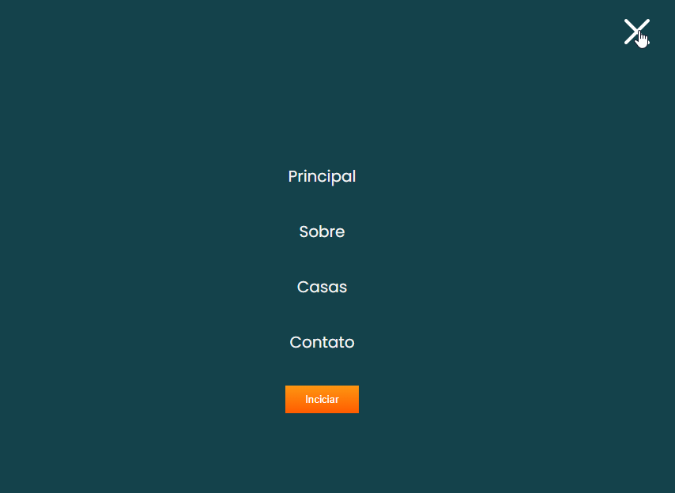

# 📱 Site Responsivo

Este é um projeto de **site responsivo** projetado para se adaptar a diferentes tamanhos de tela usando **HTML**, **CSS** e **JavaScript**. O site possui um menu de navegação, uma seção principal com imagem e texto em destaque, e comportamento responsivo para telas menores.

## 📁 Estrutura do Projeto

- **HTML**: A estrutura base do site.
- **CSS**: Usado para estilização e design responsivo.
- **JavaScript**: Manipula o comportamento interativo, como a alternância do menu de navegação.

## ⚙️ Funcionalidades

- **Menu de Navegação Responsivo**: O menu de navegação adapta-se para telas móveis com um menu hambúrguer que pode ser alternado.
- **Layout Responsivo**: O layout ajusta-se para proporcionar uma experiência de visualização otimizada em uma ampla variedade de dispositivos.

## 🛠️ Instalação

1. Clone o repositório:
   ```bash
   git clone https://github.com/4ndredev21/responsive-web-site

🚀 Uso
Abra o index.html no seu navegador para visualizar o site.
Personalize o conteúdo, estilos e scripts conforme necessário.
🛠️ Tecnologias Utilizadas
HTML5
CSS3
Flexbox para layout.
Media queries para responsividade.
JavaScript
Manipulação do DOM para elementos interativos.
📜 Créditos 4ndreDev and Matheus.
Este projeto utiliza a fonte Poppins do Google Fonts.
## 🌐 Acesse o Projeto

[Clique aqui para visualizar o site responsivo](https://4ndredev21.github.io/responsive-web-site/) 🌟


## 🌟 Prévia do Projeto

Confira abaixo um print da página principal do site:

<div align="center">
  
</div>
<div align="center">
  
</div>
<div align="center">
  
</div>
